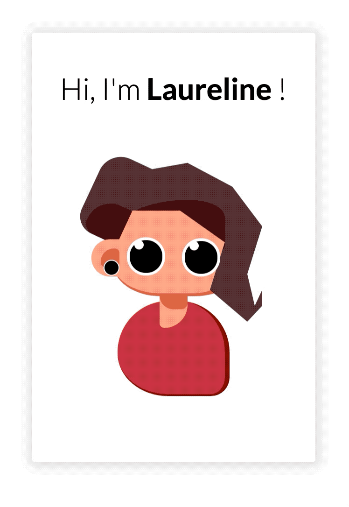

# Personal Avatar Profile - [DEMO](https://laurelinep.github.io/AvatarProfile/)

Haven't you notice how a representationnal picture is requested ? ( resumes, linkedIn, forums, etc... )
Let's agree to disagree on this one !

As a **creative developper**, I wanted to represent myself using my coding skills using only **HTML & CSS** ( preprocessed with SCSS ).

Maybe will do more features later on.