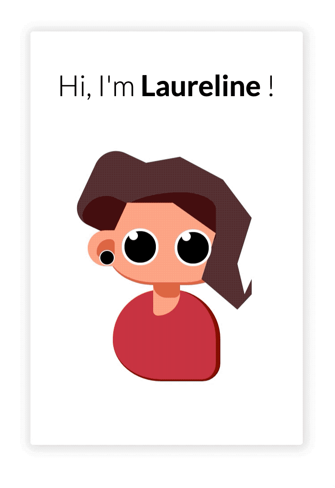

# Personal Avatar Profile - [DEMO](https://laurelinep.github.io/AvatarProfile/)
  

Haven't you notice how a representationnal picture is requested ?  
( resumes, linkedIn, forums, etc... ) Let's agree to disagree on this one !
Here is a personal CSS avatar used for my social medias - including professional one.

## Motivation
As a **creative developper**, I wanted to represent myself  
with skills using only **HTML & CSS** ( preprocessed with SCSS ).

Maybe will do more features later on.

## Contributing
You could contribute by sharing ideas or features 
by creating an issue in the repo.
